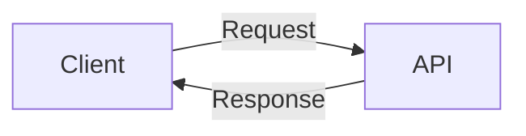

## Introduction

Web APIs are a crucial component of modern web development. They allow developers to access and manipulate data from various sources, such as databases, external services, and other applications. In this article, we will explore the basics of web APIs, their importance, and how to use them in your projects.

The easiest way to understand what an API does is by looking at a restaurant. You make an order that's taken by a waiter to the kitchen, where the chef prepares the food. The waiter then brings the food back to you, and you enjoy your meal.
The waiter in this case is the API while the chef is the server. You yourself are the client.

